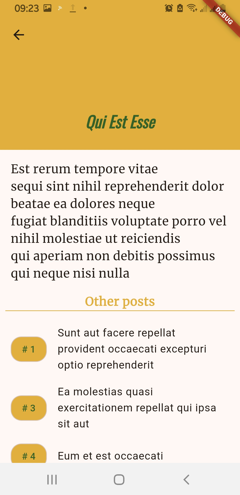
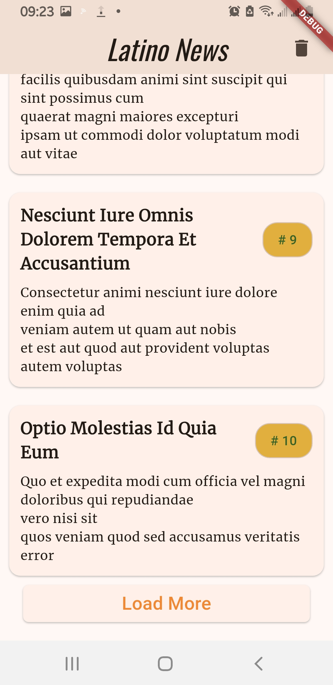
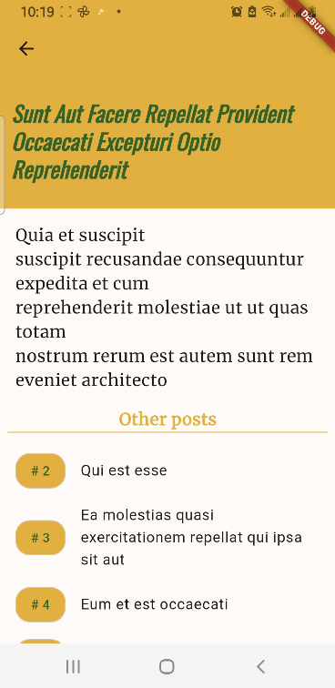
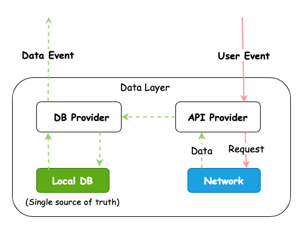

# Latino Posts

A simple project to showcase REST API with Offline Functionality

## Screenshots
Here are some screens to expect.

 &nbsp;&nbsp;&nbsp;&nbsp;  &nbsp;&nbsp;&nbsp;&nbsp; 

 &nbsp;&nbsp;&nbsp;&nbsp;  &nbsp;&nbsp;&nbsp;&nbsp; 

## Getting Started

Ensure your flutter environment is setup (use the official guide [here](https://docs.flutter.dev/get-started/install/macos/mobile-android)), then clone this project:

If using Android Studio:

1. Clone the repo from your IDE
    1. `File` -> `New` -> `Project From Version Control`
    2. Input `git@github.com:keronei/latino-posts.git` if you have set up `SSH`
       or `https://github.com/keronei/latino-posts.git` if you prefer https (not recommended).
2. Once complete, it will ask if to trust project, Go ahead and Trust its execution.
3. No special keys/dependencies, let it sync, then connect a device and run.

If you feel lucky, you can grab [release_apk](files/latino-release.apk) and run in on your Android device directly (might not be up-to-date).

If using some other editor, you can clone th project from your Terminal/Shell

```bash
git clone https://github.com/keronei/latino-posts.git
```
Next, navigate into the project directory using `cd latino-posts` and get the required packages:

```bash
flutter pub get
```

From here, open the project using your favourite editor, let it sync to completion; of course remember to hit **Run** ▶️.

## Tests
Before making any changes on the app, it is recommended to run the unit tests first and find out if there's any unexpected behaviours.

Use this command to execute the unit tests targeting the data & network handling:

```bash

flutter test 

```

Or to run specific test groups e.g:

```bash
flutter test --plain-name "getNextPage Tests" test/api/news_post_api_provider_test.dart

```

In order to run integration tests, you will **need** a device, it also takes a few seconds before launching so be patient.

```bash
flutter test integration_test/

```

## The Architecture
Below is a simplified representation of the data layer, the local db(provided by sqflite) is
preferred to be the single source of truth to ensure consistency.



## About the API
This app uses fake API from [JSON Placeholder](https://jsonplaceholder.typicode.com), the documentation can be found at [JSON Placeholder guide](https://jsonplaceholder.typicode.com/guide).

To achieve pagination, use query param `_page` to select a page you want to request with `_limit` to cap the number of items per page.

An example of a request to get first page of 20 posts would be:

```bash

curl -X  GET "https://jsonplaceholder.typicode.com/posts?_page=1&_limit=20"

```

The response will be a JSON as below

```json
{
  "id": 1,
  "title": "String title goes here",
  "body": "Body of the post",
  "userId": 1
}
```

## What can be improved
- When a network error occurs, trigger last failed request when connection is established.
- Implement sqflite versioning to allow migration in the future. 

## Dependencies et all

| Package                                                  | Purpose                                                   |       
|----------------------------------------------------------|-----------------------------------------------------------|
| [http](https://pub.dev/packages/http)                    | For taking care of http requests                          |        
| [path_provider](https://pub.dev/packages/path_provider)  | Handle locations on the system - specifically for db file |
| [path](https://pub.dev/packages/path)                    | Enables manipulating various paths                        |
| [sqflite](https://pub.dev/packages/sqflite)              | For storing the posts on device.                          |
| [test](https://pub.dev/packages/test)                    | Assist in verifying behaviour an unit level               |
| [provider](https://pub.dev/packages/provider)            | To "inject" class instances instead of re-initiation      |
| [Mocktail](https://pub.dev/packages/mocktail)            | Create mocks with less boilerplate and faster writing of tests |